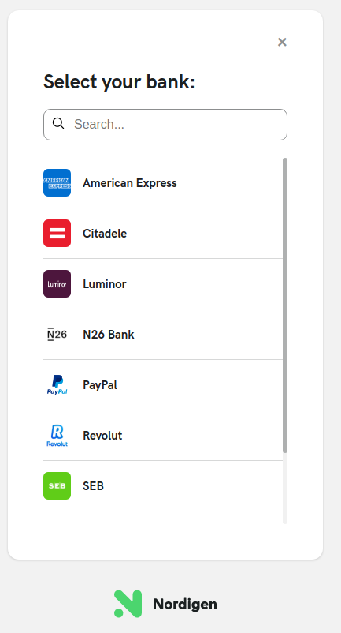
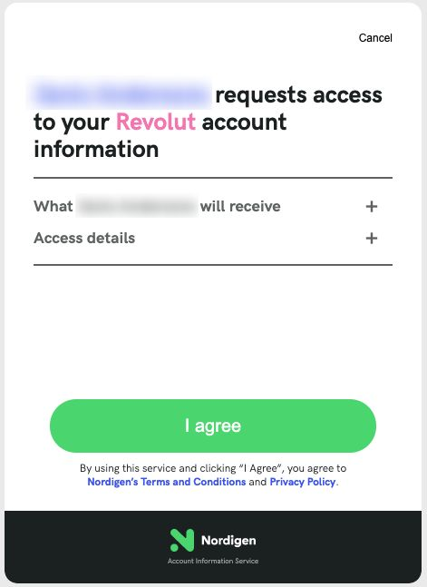
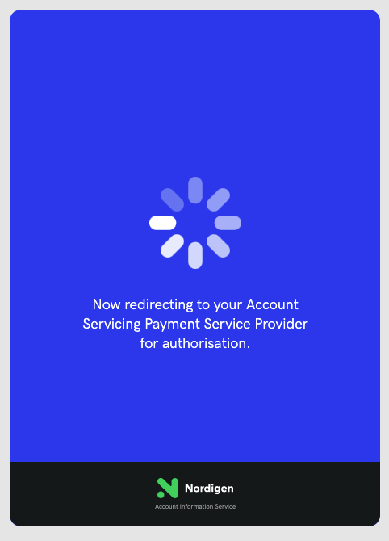
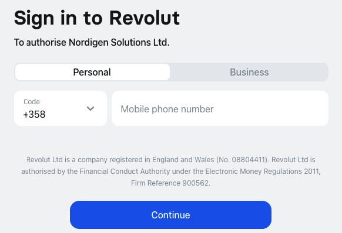
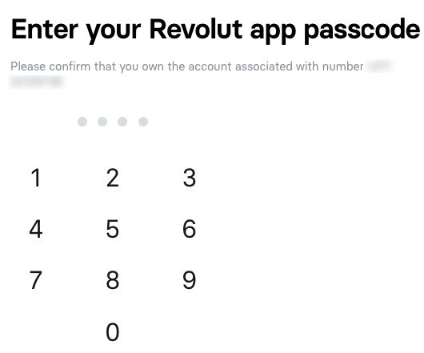
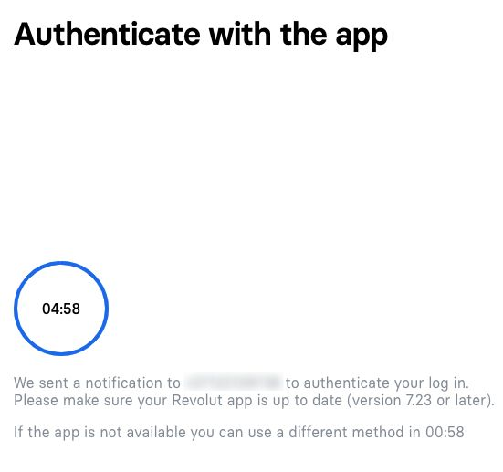
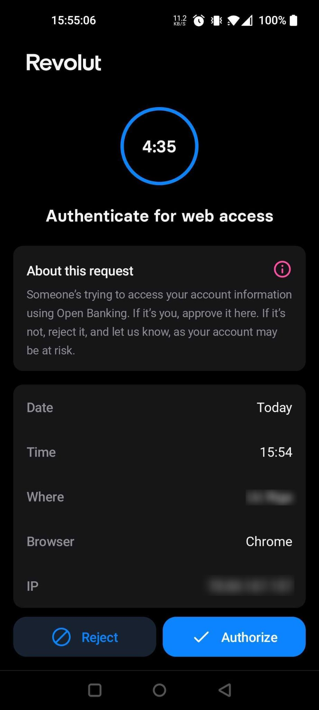
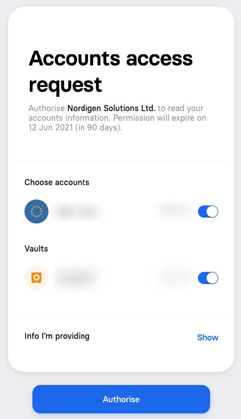

# Nordigen Python example with Flask

## Set-up

You'll need to get your `SECRET_ID` and `SECRET_KEY` from the [GoCardless' Bank Account Data Portal](https://bankaccountdata.gocardless.com/).
In **app.py** file provide the token as a parameter for `NordigenClient`.

```python
import os

# import Nordigen client
from nordigen import NordigenClient

# Init Nordigen client pass secret_id and secret_key generated from Nordigen portal
# Parameters can be loaded from .env or passed as a string
# You have to modify secrets in app.py file
client = NordigenClient(
  secret_id=os.getenv("SECRET_ID"),
  secret_key=os.getenv("SECRET_KEY")
)

# Generate access & refresh token
# Note: access_token is automatically injected to other requests after you successfully obtain it
client.generate_token()
```

To initialize session with a bank, you have to specify `COUNTRY` (a two-letter country code) and your `REDIRECT_URI`.

Modify following variables in `app.py` file
```python
COUNTRY = 'LV'
REDIRECT_URI = 'http://127.0.0.1:5000/result'
```


## Installation

Install required dependencies

```bash
pip install -r requirements.txt
```

Start Flask project

```bash
flask run
```

Below is an example of the authentication process with Revolut.

### 1. Go to http://localhost:5000/ and select bank
<p align="center">
    
</p>

### 2. Provide consent
<p align="center">
  
  
</p>

### 3. Sign into bank (Institution)
<p align="center">
  
  
  
</p>

<p align="center">
  
</p>

### 4. Select accounts
<p align="center">
  
</p>

### 5. You will be redirected to specified `redirect_uri` in our case it is `http://localhost:5000/` where details, balances and transactions will be returned from your bank account.
